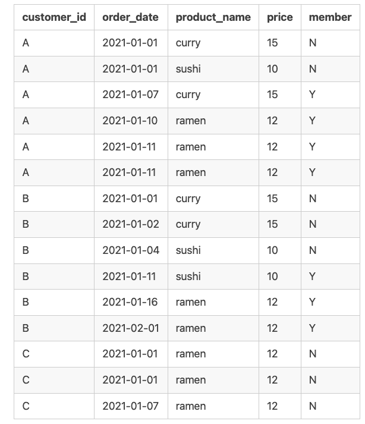
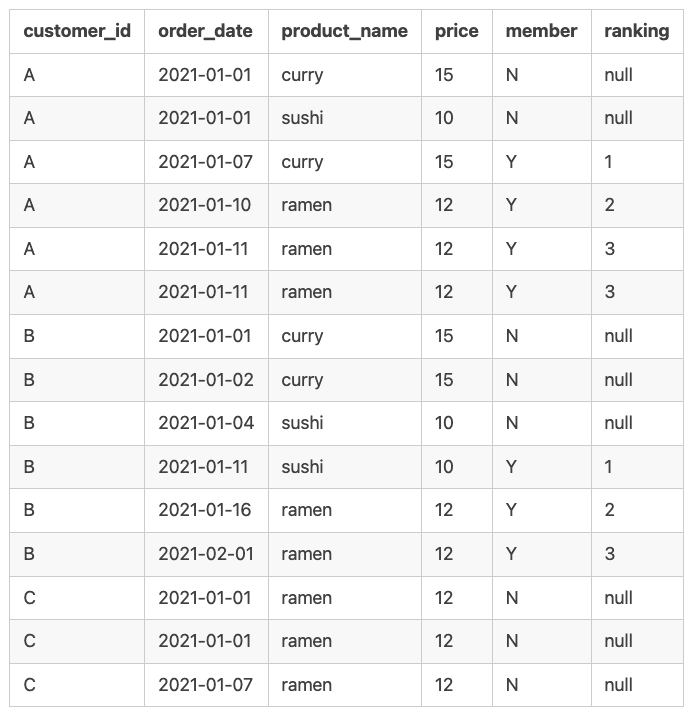

# Case Study 1 - Danny's Diner
*This case study is part of the 8 weeks SQL challenge which you can find details [here](https://8weeksqlchallenge.com/)

## Introduction
Danny seriously loves Japanese food so in the beginning of 2021, he decides to embark upon a risky venture and opens up a cute little restaurant that sells his 3 favourite foods: sushi, curry and ramen. Danny's Diner wants the restaurant to stay afloat. They have captured some very basic data from their first few months of operation but have no idea how to use their data to help them run the business.

## Problem Statement
Danny wants to use the data to answer a few simple questions about his customers, especially about their visiting patterns, how much money they’ve spent and also which menu items are their favourite. Having this deeper connection with his customers will help him deliver a better and more personalised experience for his loyal customers.

He plans on using these insights to help him decide whether he should expand the existing customer loyalty program.  Additionally he needs help to generate some basic datasets so his team can easily inspect the data without needing to use SQL.

## The Data
Danny has provided a sample of his overall customer data. The 3 key datasets for this case study are sales, menu and members. Here's a view of the relationship between the 3 tables:


## Danny's questions and my SQL solutions:

**1. What is the total amount each customer spent at the restaurant?**

```sql
SELECT
  sales.customer_id,
  SUM(menu.price) AS total_amount_paid
FROM
  dannys_diner.sales AS sales
LEFT JOIN dannys_diner.menu AS menu
  ON sales.product_id = menu.product_id
GROUP BY sales.customer_id
ORDER BY customer_id;
```
**Output**

customer_id | total_amount_paid
----------- | ------------
A           | 76
B           | 74
C           | 36


**2. How many days has each customer visited the restaurant?** 

```sql
SELECT
  customer_id,
  COUNT (DISTINCT order_date) AS visit_num_days
FROM dannys_diner.sales
GROUP BY customer_id;
 ```
 **Output**
 customer_id | visit_num_days
----------- | --------------
A           | 4
B           | 6
C           | 2


**3. What was the first item from the menu purchased by each customer?**  

```sql
WITH ordered_dish AS( 
 SELECT
   sales.customer_id,
   menu.product_name,
   ROW_NUMBER() OVER(PARTITION BY sales.customer_id ORDER BY sales.order_date) AS order_rank
 FROM dannys_diner.sales
 LEFT JOIN dannys_diner.menu
   ON sales.product_id = menu.product_id
GROUP BY sales.customer_id, menu.product_name, sales.order_date
 )
 
 SELECT
   customer_id,
   product_name
FROM ordered_dish
WHERE order_rank = 1;
```
**Output**
customer_id | product_name
----------- | ------------
A           | curry
A           | sushi
B           | curry
C           | ramen


**4. What is the most purchased item on the menu and how many times was it purchased by all customers?** 

```sql
SELECT
   menu.product_name,
   COUNT(sales.*) AS total_purchased
FROM dannys_diner.sales
INNER JOIN dannys_diner.menu
   ON sales.product_id = menu.product_id
GROUP BY product_name
ORDER BY total_purchased DESC
LIMIT 1;
```
**Output**
product_name | total_purchased
------------ | -------------------
ramen        | 8


**5. Which item was the most popular for each customer?**  

```sql
WITH customer_order AS(
SELECT
  sales.customer_id,
  menu.product_name,
  COUNT(sales.product_id) AS total_times_purchased,
  RANK() OVER (PARTITION BY sales.customer_id ORDER BY COUNT(sales.product_id)DESC) AS order_rank
FROM dannys_diner.sales
INNER JOIN dannys_diner.menu
  ON sales.product_id = menu.product_id
GROUP BY sales.customer_id, menu.product_name
)

SELECT
  customer_id,
  product_name,
  total_times_purchased
FROM customer_order
WHERE order_rank = 1;
```
**Output**
customer_id | product_name  | total_times_purchase
----------- | ------------- | ---------------------
A           | ramen         | 3
B           | sushi         | 2
B           | curry         | 2
B           | ramen         | 2
C           | ramen         | 3


**6. Which item was purchased first by the customer after they became a member?**

```sql
WITH base AS(
SELECT
  sales.customer_id,
  sales.order_date,
  menu.product_name,
  RANK() OVER (PARTITION BY sales.customer_id 
    ORDER BY sales.order_date) AS order_rank
FROM dannys_diner.sales
INNER JOIN dannys_diner.menu
  ON sales.product_id = menu.product_id
INNER JOIN dannys_diner.members
  ON sales.customer_id = members.customer_id
WHERE sales.order_date >= members.join_date

)

SELECT
  customer_id,
  order_date,
  product_name
FROM base
WHERE order_rank = 1;
```
**Output**
customer_id | order_date  | product_name
----------- | ----------- | ------------
A           | 2021-01-07  | curry
B           | 2021-01-11  | sushi


**7. Which item was purchased just before the customer became a member?** 
```sql
SELECT
  sales.customer_id,
  menu.product_name,
  sales.order_date,
  RANK() OVER(PARTITION BY sales.customer_id
    ORDER BY sales.order_date DESC) AS order_rank
FROM dannys_diner.sales
INNER JOIN dannys_diner.members
  ON sales.customer_id = members.customer_id
INNER JOIN dannys_diner.menu
  ON sales.product_id = menu.product_id
WHERE sales.order_date < members.join_date
)

SELECT DISTINCT
  customer_id,
  order_date,
  product_name
FROM customer_order
WHERE order_rank = 1;
```
**Output**

customer_id | order_date  | product_name
----------- | ----------- | ------------
A           | 2021-01-01  | curry
A           | 2021-01-01  | sushi
B           | 2021-01-04  | sushi

**8. What is the total items and amount spent for each member before they became a member?**  
```sql
SELECT 
  sales.customer_id,
  COUNT (DISTINCT (sales.product_id)) AS total_items,
  SUM(menu.price) AS total_price
FROM dannys_diner.sales
LEFT JOIN dannys_diner.menu
  ON sales.product_id = menu.product_id
INNER JOIN dannys_diner.members
  ON sales.customer_id = members.customer_id
WHERE sales.order_date < members.join_date
GROUP BY sales.customer_id;
```
**Output**
customer_id | total_items | total_price
----------- | ----------- | ------------
A           | 2           | 25
B           | 2           | 40

**9. If each $1 spent equates to 10 points and sushi has a 2x points multiplier - how many points would each customer have?**

```sql
WITH customer_purchase AS (
SELECT
  sales.customer_id,
  menu.product_name,
  SUM(menu.price) AS total_price
FROM dannys_diner.sales
LEFT JOIN dannys_diner.menu
  ON sales.product_id = menu.product_id
GROUP BY sales.customer_id, menu.product_name, menu.price
)

SELECT
  customer_id,
  SUM(CASE WHEN (product_name = 'sushi') THEN total_price * 20  ELSE
    total_price * 10 END) AS loyalty_points
FROM customer_purchase
GROUP BY customer_id
ORDER BY loyalty_points DESC;
```
**Output**

customer_id | loyalty_points
----------- | ------------
B           | 940
A           | 860
C           | 360

**10. In the first week after a customer joins the program (including their join date) they earn 2x points on all items, not just sushi - how many points do customer A and B have at the end of January?**  

*Note that the following code was written on the assumption that the customer will only get points when they join the programme*

```sql
WITH customer_purchase AS(
SELECT
  sales.customer_id,
  sales.order_date,
  menu.product_name,
  SUM(menu.price) AS total_price,
  members.join_date
FROM
  dannys_diner.sales
INNER JOIN dannys_diner.menu
ON sales.product_id = menu.product_id
INNER JOIN dannys_diner.members
ON sales.customer_id = members.customer_id
# assumption made that customers will only get loyalty points when they join the programme.
WHERE sales.order_date >= members.join_date
GROUP BY sales.customer_id, sales.order_date, menu.product_name, members.join_date
)

SELECT
  customer_id,
  SUM(CASE WHEN order_date BETWEEN join_date AND join_date + 6 OR product_name = 'sushi' THEN 20 * total_price
    ELSE 10 * total_price END) AS total_points
FROM customer_purchase
WHERE DATE_PART('MONTH', order_date::DATE) = 01
GROUP BY customer_id
ORDER BY customer_id;
```

**Output**
customer_id | total_points
----------- | ------------
A           | 1020
B           | 320

**Bonus Question - Join all the things - recreate the basic data tables so that Danny and his team can use to derive insights without needing to join the tables using SQL. They should look like this:**



```sql
WITH base AS(
SELECT
  sales.customer_id,
  sales.order_date,
  menu.product_name,
  menu.price,
  members.join_date
FROM dannys_diner.sales
LEFT JOIN dannys_diner.menu
  ON sales.product_id = menu.product_id
LEFT JOIN dannys_diner.members
  ON sales.customer_id = members.customer_id
)
SELECT
  customer_id,
  order_date,
  product_name,
  price,
  CASE WHEN join_date IS NULL OR order_date < join_date THEN 'N' ELSE 'Y' END AS member
FROM base
ORDER BY customer_id, order_date;
```

**Bonus Question - Rank all the things - Danny also requires further information about the ranking of customer products but he does not need the ranking for non member purchases so he expects null ranking values for the records when customers are not yet part of the loyalty programme. The output should look like this:**




```sql
WITH base AS(
SELECT
  sales.customer_id,
  sales.order_date,
  menu.product_name,
  menu.price,
  members.join_date,
  CASE WHEN members.join_date IS NULL OR sales.order_date < members.join_date THEN 'N' ELSE 'Y' END AS member
FROM dannys_diner.sales
LEFT JOIN dannys_diner.menu
  ON sales.product_id = menu.product_id
LEFT JOIN dannys_diner.members
  ON sales.customer_id = members.customer_id

)

SELECT
  customer_id,
  order_date,
  product_name,
  price,
  member,
  CASE WHEN member = 'N' THEN null
  ELSE
    RANK() OVER (PARTITION BY customer_id, member ORDER BY order_date) END AS ranking
FROM base
ORDER BY customer_id, order_date;
```
