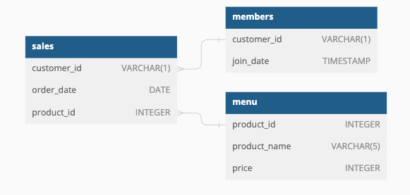

# Case Study 1 - Danny's Diner
*This case study is part of the 8 weeks SQL challenge which you can find details [here](https://8weeksqlchallenge.com/)

## Introduction
Danny seriously loves Japanese food so in the beginning of 2021, he decides to embark upon a risky venture and opens up a cute little restaurant that sells his 3 favourite foods: sushi, curry and ramen. Danny's Diner wants the restaurant to stay afloat. They have captured some very basic data from their first few months of operation but have no idea how to use their data to help them run the business.

## Problem Statement
Danny wants to use the data to answer a few simple questions about his customers, especially about their visiting patterns, how much money they’ve spent and also which menu items are their favourite. Having this deeper connection with his customers will help him deliver a better and more personalised experience for his loyal customers.

He plans on using these insights to help him decide whether he should expand the existing customer loyalty program.  Additionally he needs help to generate some basic datasets so his team can easily inspect the data without needing to use SQL.

## The Data
Danny has provided a sample of his overall customer data. The 3 key datasets for this case study are sales, menu and members. Here's a view of the relationship between the 3 tables:




## Danny's questions and my SQL solutions:

**1. What is the total amount each customer spent at the restaurant?**

```sql
SELECT
  sales.customer_id,
  SUM(menu.price) AS total_amount_paid
FROM
  dannys_diner.sales AS sales
LEFT JOIN dannys_diner.menu AS menu
  ON sales.product_id = menu.product_id
GROUP BY sales.customer_id
ORDER BY customer_id;
```
**Output**

customer_id | total_amount_paid
----------- | ------------
A           | 76
B           | 74
C           | 36

**2. How many days has each customer visited the restaurant?** 

```sql
SELECT
  customer_id,
  COUNT (DISTINCT order_date) AS visit_num_days
FROM dannys_diner.sales
GROUP BY customer_id;
 ```
 **Output**
 customer_id | visit_num_days
----------- | --------------
A           | 4
B           | 6
C           | 2

**3. What was the first item from the menu purchased by each customer?**  

```sql
WITH ordered_dish AS( 
 SELECT
   sales.customer_id,
   menu.product_name,
   ROW_NUMBER() OVER(PARTITION BY sales.customer_id ORDER BY sales.order_date) AS order_rank
 FROM dannys_diner.sales
 LEFT JOIN dannys_diner.menu
   ON sales.product_id = menu.product_id
GROUP BY sales.customer_id, menu.product_name, sales.order_date
 )
 
 SELECT
   customer_id,
   product_name
FROM ordered_dish
WHERE order_rank = 1;
```
**Output**
customer_id | product_name
----------- | ------------
A           | curry
A           | sushi
B           | curry
C           | ramen

**4. What is the most purchased item on the menu and how many times was it purchased by all customers?** 

```sql
SELECT
   menu.product_name,
   COUNT(sales.*) AS total_purchased
FROM dannys_diner.sales
INNER JOIN dannys_diner.menu
   ON sales.product_id = menu.product_id
GROUP BY product_name
ORDER BY total_purchased DESC
LIMIT 1;
```
**Output**
product_name | total_purchased
------------ | -------------------
ramen        | 8

