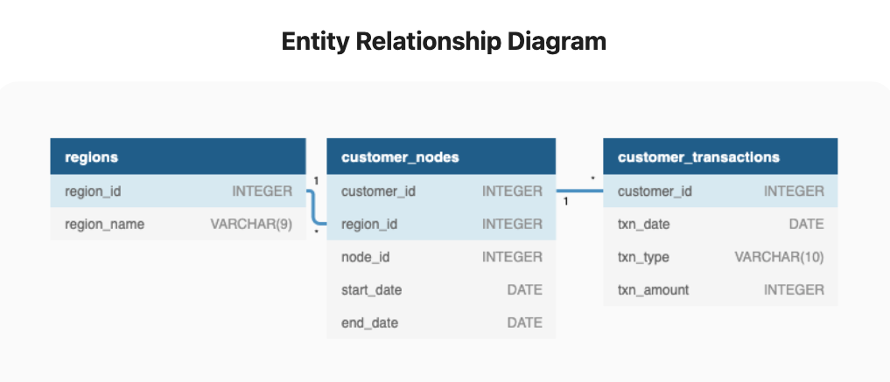
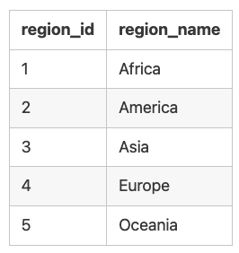
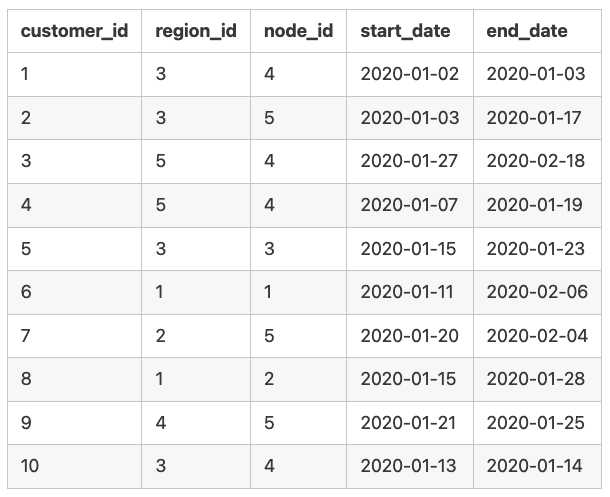
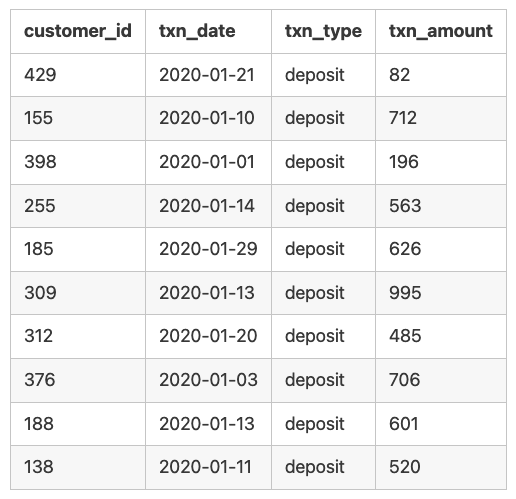

*This case study is part of the 8 weeks SQL challenge which you can find details [here](https://8weeksqlchallenge.com/)

## Introduction
There is a new innovation in the financial industry called Neo-Banks: new aged digital only banks without physical branches.

Danny thought that there should be some sort of intersection between these new age banks, cryptocurrency and the data world…so he decides to launch a new initiative - Data Bank!

Data Bank runs just like any other digital bank - but it isn’t only for banking activities, they also have the world’s most secure distributed data storage platform!

Customers are allocated cloud data storage limits which are directly linked to how much money they have in their accounts. There are a few interesting caveats that go with this business model, and this is where the Data Bank team need your help!

The management team at Data Bank want to increase their total customer base - but also need some help tracking just how much data storage their customers will need.

This case study is all about calculating metrics, growth and helping the business analyse their data in a smart way to better forecast and plan for their future developments!

## Available Data
The Data Bank team have prepared a data model for this case study as well as a few example rows from the complete dataset below to get you familiar with their tables.


<details>
<summary> Table 1: Regions</summary>
  
Just like popular cryptocurrency platforms - Data Bank is also run off a network of nodes where both money and data is stored across the globe. In a traditional banking sense - you can think of these nodes as bank branches or stores that exist around the world.

This regions table contains the region_id and their respective region_name values: <br>

</details>

<details>
<summary> Table 2: Customer Nodes</summary>
  
Customers are randomly distributed across the nodes according to their region - this also specifies exactly which node contains both their cash and data.

This random distribution changes frequently to reduce the risk of hackers getting into Data Bank’s system and stealing customer’s money and data!

Below is a sample of the top 10 rows of the data_bank.customer_nodes: <br>

</details>

<details>
<summary> Table 3: Customer Transactions</summary>
  
This table stores all customer deposits, withdrawals and purchases made using their Data Bank debit card:<br>

</details>

<br>

## The business questions and my SQL solutions:<br>

### Customer Nodes Exploration

**1. How many unique nodes are there on the Data Bank system?**

```sql
WITH unique_nodes AS(
SELECT
  region_id,
  COUNT(DISTINCT node_id) AS unique_nodes
FROM data_bank.customer_nodes
GROUP BY region_id
)

SELECT
  SUM(unique_nodes) AS total_unique_nodes
FROM unique_nodes;
```

**Output**

total_unique_nodes
--|
25  |

<br>

**2. What is the number of nodes per region?**

```sql
SELECT
  r.region_name,
  COUNT(DISTINCT c.node_id)
FROM data_bank.customer_nodes AS c
INNER JOIN data_bank.regions AS r
  ON c.region_id = r.region_id
GROUP BY r.region_name;
```

**Output**

region_name | output
--  | --
Africa  | 5
America | 5
Asia  | 5
Australia | 5
Europe  | 5

<br>

**3. How many customers are allocated to each region?**

```sql
SELECT
  r.region_name,
  COUNT(DISTINCT c.customer_id) AS customer_number
FROM data_bank.customer_nodes AS c
INNER JOIN data_bank.regions AS r
ON c.region_id = r.region_id
GROUP BY r.region_name
ORDER BY customer_number DESC;
```

**Output**

region_name | customer_number
--  | --
Australia | 110
America | 105
Africa  | 102
Asia  | 95
Europe  | 88

<br>

**4. How many days on average are customers reallocated to a different node?**

The following code was my original solution which gave me the **output of 14 days** as average duration:

```sql

WITH node_change AS(
SELECT
  customer_id,
  node_id,
  region_id,
  DATE_PART('DAY', AGE(end_date, start_date))::INTEGER AS days_difference,
  ROW_NUMBER() OVER(PARTITION BY customer_id ORDER BY start_date) AS row_number
FROM data_bank.customer_nodes
)

SELECT
  ROUND(AVG(days_difference)) AS avg_duration
FROM node_change;
```
<br>

However, I have just been thrown a curve ball. Apparently, there are times where the same node is allocated to the same customer_id. Therefore to deal with this, we need to use recursive cte. Start the recursion by setting an initial 1 value for run_id for each customer record, using the start_date. If the current row does not match the previous row, then increment the run_id by 1:

```sql
DROP TABLE IF EXISTS ranked_customer_nodes;
CREATE TEMP TABLE ranked_customer_nodes AS
SELECT
  customer_id,
  node_id,
  region_id,
  DATE_PART('day', AGE(end_date, start_date))::INTEGER AS duration,
  ROW_NUMBER() OVER (PARTITION BY customer_id ORDER BY start_date) AS row_number
FROM data_bank.customer_nodes;


WITH RECURSIVE output_table AS (
SELECT
  customer_id,
  node_id,
  duration,
  row_number,
  1 as run_id
FROM ranked_customer_nodes
WHERE row_number = 1

UNION

SELECT
  t1.customer_id,
  t2.node_id,
  t2.duration,
  t2.row_number,
  CASE WHEN t1.node_id <> t2.node_id THEN t1.run_id + 1 ELSE t1.run_id END AS run_id
FROM output_table AS t1
INNER JOIN ranked_customer_nodes AS t2
  ON t1.row_number + 1 = t2.row_number
  AND t1.customer_id = t2.customer_id
  AND t2.row_number > 1
),

cte AS(
  SELECT
    customer_id,
    run_id,
    SUM(duration) AS node_duration
  FROM output_table
  where customer_id = 1
  GROUP BY
    customer_id,
    run_id
)

SELECT
  ROUND(AVG(node_duration)) AS avg_duration
FROM cte;
```

**Output**
avg_duration
--  |
17  |


