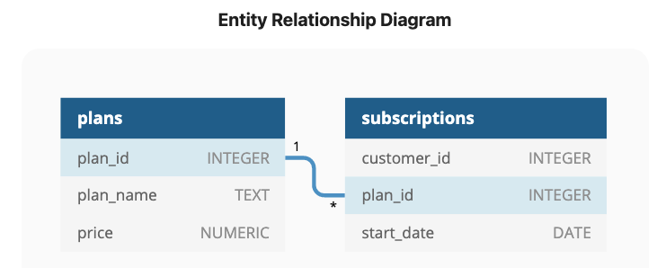
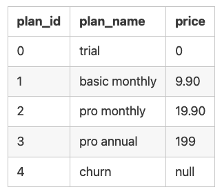

# Case Study 3 - Foodie Fi
*This case study is part of the 8 weeks SQL challenge which you can find details [here](https://8weeksqlchallenge.com/)

## Introduction
Subscription based businesses are super popular and Danny realised that there was a large gap in the market - he wanted to create a new streaming service that only had food related content - something like Netflix but with only cooking shows!

Danny finds a few smart friends to launch his new startup Foodie-Fi in 2020 and started selling monthly and annual subscriptions, giving their customers unlimited on-demand access to exclusive food videos from around the world!

Danny created Foodie-Fi with a data driven mindset and wanted to ensure all future investment decisions and new features were decided using data. This case study focuses on using subscription style digital data to answer important business questions.

## Available Data and Business Case
Danny has shared the data design for Foodie-Fi and also short descriptions on each of the database tables:



**Table 1: plans**
Customers can choose which plans to join Foodie-Fi when they first sign up.

Basic plan customers have limited access and can only stream their videos and is only available monthly at $9.90

Pro plan customers have no watch time limits and are able to download videos for offline viewing. Pro plans start at $19.90 a month or $199 for an annual subscription.

Customers can sign up to an initial 7 day free trial where they will automatically continue with the pro monthly subscription plan unless they cancel, downgrade to basic or upgrade to an annual pro plan at any point during the trial.

When customers cancel their Foodie-Fi service - they will have a churn plan record with a null price but their plan will continue until the end of the billing period. See table below:<br><br>

<br>

**Table 2: subscriptions**
Customer subscriptions show the exact date where their specific plan_id starts.

If customers downgrade from a pro plan or cancel their subscription - the higher plan will remain in place until the period is over - the start_date in the subscriptions table will reflect the date that the actual plan changes.

When customers upgrade their account from a basic plan to a pro or annual pro plan - the higher plan will take effect straightaway.

When customers churn - they will keep their access until the end of their current billing period but the start_date will be technically the day they decided to cancel their service. See sample table below:<br><br>


<br>

## The business questions and my SQL solutions:

### Customer Journey

**Based off the 8 sample customers provided in the sample from the subscriptions table, write a brief description about each customer’s onboarding journey.**

```sql
SELECT
  s.customer_id,
  p.plan_name,
  s.start_date
FROM foodie_fi.subscriptions AS s
INNER JOIN foodie_fi.plans AS p
  ON s.plan_id = p.plan_id
  WHERE s.customer_id IN ('1', '2', '11', '13', '15', '16', '18', '19')
ORDER BY customer_id, start_date;
```

**Output**

customer_id | plan_name | start_date
--  |  -- | --
1 | trial | 2020-08-01
1 | basic monthly | 2020-08-08
2 | trial | 2020-09-20
2 | pro annual  | 2020-09-27
11 |  trial | 2020-11-19
11  | churn | 2020-11-26
13  | trial | 2020-12-15
13  | basic monthly | 2020-12-22
13  | pro monthly | 2021-03-29
15  | trial | 2020-03-17
15  | pro monthly  | 2020-03-24
15  | churn | 2020-04-29
16  | trial | 2020-05-31
16  | basic monthly | 2020-06-07
16  | pro annual  | 2020-10-21
18  | trial | 2020-07-06
18  | pro monthly | 2020-07-13
19  | trial | 2020-06-22
19  | pro monthly | 2020-06-29
19  | pro annual  | 2020-08-29
<br>

---
### Data Analysis Questions

**1. How many customers has Foodie-Fi ever had?**

```sql
SELECT 
  COUNT(*) AS total_customer_num
FROM(
  SELECT DISTINCT customer_id
    FROM foodie_fi.subscriptions) AS subquery
;
```

**Output**

total_customer_num
--|
1000

<br>

**2. What is the monthly distribution of trial plan start_date values for our dataset - use the start of the month as the group by value**

```sql
SELECT
  DATE_TRUNC('month', o.start_date)::DATE AS start_of_month,
  count(o.*) AS total_num
FROM foodie_fi.subscriptions AS o
INNER JOIN foodie_fi.plans AS p
  ON o.plan_id = p.plan_id
WHERE p.plan_name = 'trial'
GROUP BY start_of_month
ORDER BY start_of_month;
```

**Output**

start_of_month  | total_num
--  | --
2020-01-01  | 88
2020-02-01  | 68
2020-03-01  | 94
2020-04-01  | 81
2020-05-01  | 88
2020-06-01  | 79
2020-07-01  | 89
2020-08-01  | 88
2020-09-01  | 87
2020-10-01  | 79
2020-11-01  | 75
2020-12-01  | 84

<br>

**3. What plan start_date values occur after the year 2020 for our dataset? Show the breakdown by count of events for each plan_name?**

```sql
SELECT
  p.plan_name,
  COUNT(*) AS event_count
FROM foodie_fi.subscriptions AS s
INNER JOIN foodie_fi.plans AS p
  ON s.plan_id = p.plan_id
  AND s.start_date > '2020-12-31'
GROUP BY p.plan_name
ORDER BY event_count DESC;
```

**Output**

plan_name | event_count
--  | --
churn | 71
pro annual  | 63
pro monthly | 60
basic monthly | 8

<br>

**4. What is the customer count and percentage of customers who have churned rounded to 1 decimal place?**

```sql
SELECT
  SUM(CASE WHEN plan_id = 4 THEN 1 ELSE 0 END) AS churn_number,
  ROUND(
    100 * SUM(CASE WHEN plan_id = 4 THEN 1 ELSE 0 END)::NUMERIC /
      COUNT(DISTINCT customer_id),
  1) AS percentage_of_churn
FROM foodie_fi.subscriptions;
```

**Output**

churn_number  | percentage_of_churn
--  | --
307 | 30.7
<br>

**5. How many customers have churned straight after their initial free trial - what percentage is this rounded to the nearest whole number?**

```sql
WITH plans AS(
  SELECT 
    customer_id,
    plan_id,
    ROW_NUMBER() OVER (
      PARTITION BY customer_id
      ORDER BY start_date
    ) AS plan_rank
  FROM foodie_fi.subscriptions
)

SELECT
  SUM(CASE WHEN plan_id = 4 THEN 1 ELSE 0 END) AS churn_numbers,
  ROUND(
    100 * SUM(CASE WHEN plan_id = 4 THEN 1 ELSE 0 END)::NUMERIC /
    COUNT(*),
  1) AS percentage_churn
FROM plans
WHERE plan_rank = 2;
```

**Output**

churn_numbers | percentrage_churn
--  | --
92  | 9.2

<br>

**6. What is the number and percentage of customer plans after their initial free trial?**

```sql
WITH cte_plan_rank AS(
SELECT
  customer_id,
  plan_id,
  ROW_NUMBER() OVER (
    PARTITION BY customer_id ORDER BY start_date
  ) AS plan_rank
FROM foodie_fi.subscriptions
)

SELECT
  p.plan_name,
  COUNT(c.*) AS customer_num,
  ROUND(100* COUNT(c.*) /SUM (COUNT(*)) OVER(),1) AS percentage
FROM cte_plan_rank AS c
INNER JOIN foodie_fi.plans AS p
  ON c.plan_id = p.plan_id
  AND c.plan_rank = 2
GROUP BY plan_name
ORDER BY percentage DESC;
```
**Output**

plan_name | customer_num  | percentage
--  | --  | --
basic monthly | 546 | 54.6
pro monthly | 325 | 32.5
churn | 92   | 9.2
pro annual  | 37  | 3.7

<br>

**7. What is the customer count and percentage breakdown of all 5 plan_name values at 2020-12-31?**

```sql
WITH valid_subscriptions AS (
  SELECT
    customer_id,
    plan_id,
    start_date,
    ROW_NUMBER() OVER (
      PARTITION BY customer_id
      ORDER BY start_date DESC
    ) AS plan_rank
  FROM foodie_fi.subscriptions
  WHERE start_date <= '2020-12-31'
)

SELECT
  p.plan_name,
  COUNT(DISTINCT v.customer_id) AS customers,
  ROUND
    (100 * COUNT(v.*) / SUM(COUNT(v.*)) OVER()
  , 1) AS percentage
FROM 
  valid_subscriptions AS v
INNER JOIN foodie_fi.plans AS p
  ON v.plan_id = p.plan_id
  AND v.plan_rank = 1
GROUP BY
  v.plan_id, plan_name
ORDER BY percentage DESC;
```
**Output**

plan_name | customers | percentage
--  | --  | --
pro monthly |  326  | 32.6
churn | 236 | 23.6
basic monthly | 224 | 22.4
pro annual  | 195 | 19.5
trial | 19  | 1.9

<br>

**8. How many customers have upgraded to an annual plan in 2020?**

```sql
SELECT
  COUNT(DISTINCT s.customer_id) AS customer_num
FROM foodie_fi.subscriptions AS s
INNER JOIN foodie_fi.plans AS p
  ON s.plan_id = p.plan_id
  AND s.start_date BETWEEN '2020-01-01' AND '2020-12-31'
WHERE p.plan_name LIKE '%nnua%';

```
**Output**
customer_num
--|
195 |

<br>

**9. How many days on average does it take for a customer to upgrade to an annual plan from the day they join Foodie-Fi?**

```sql
WITH annual_subscribers AS(
SELECT
  customer_id,
  start_date 
FROM foodie_fi.subscriptions
WHERE plan_id = 3
),

trial_subscribers AS(
SELECT
  customer_id,
  start_date 
FROM foodie_fi.subscriptions
WHERE plan_id = 0
)

SELECT
  ROUND(AVG (a.start_date - t.start_date)) AS avg_days_to_upgrade
FROM annual_subscribers AS a
INNER JOIN trial_subscribers AS t
  ON a.customer_id = t.customer_id;
```
**Output**

avg_days_to_upgrade
--|
105 |

**10. Can you further breakdown this average value into 30 day periods (i.e. 0-30 days, 31-60 days etc)**

```sql
WITH annual_subscribers AS(
SELECT
  customer_id,
  start_date 
FROM foodie_fi.subscriptions
WHERE plan_id = 3
),

trial_subscribers AS(
SELECT
  customer_id,
  start_date 
FROM foodie_fi.subscriptions
WHERE plan_id = 0
),

duration AS (
  SELECT WIDTH_BUCKET(a.start_date - t.start_date, 0, 360,12) AS avg_days_to_upgrade
  FROM annual_subscribers AS a
  INNER JOIN trial_subscribers AS t
    ON a.customer_id = t.customer_id
)
SELECT ((avg_days_to_upgrade - 1)*30 || '-' || (avg_days_to_upgrade)*30) AS "30_day_period", 
COUNT(*) AS customer_num
FROM duration
GROUP BY avg_days_to_upgrade
ORDER BY avg_days_to_upgrade;
```
**Output**

30_day_period | customer_num
--  | --
0-30  | 48
30-60 | 25
60-90 | 33
90-120  | 35
120-150 | 43
150-180 | 35
180-210 | 27
210 - 240 | 4
240-270 | 5
270-300 | 1
300-330 | 1
330-360 | 1

<br>

**11. How many customers downgraded from a pro monthly to a basic monthly plan in 2020?**

```sql
WITH plan_switch AS(
SELECT
  customer_id,
  plan_id,
  start_date,
  LAG(plan_id) OVER (
    PARTITION BY customer_id ORDER BY start_date DESC)
  AS previous_plan_id
FROM foodie_fi.subscriptions
WHERE start_date BETWEEN '2020-01-01' AND '2020-12-31'
)

SELECT
  COUNT(customer_id) AS customer_count
FROM plan_switch
WHERE previous_plan_id = 2 and plan_id = 1;
```
**Output**

customer_count
--  |
163 |

<br>

---

### Payment Question

**The Foodie-Fi team wants you to create a new payments table for the year 2020 that includes amounts paid by each customer in the subscriptions table with the following requirements:**

- **monthly payments always occur on the same day of month as the original start_date of any monthly paid plan**
- **upgrades from basic to monthly or pro plans are reduced by the current paid amount in that month and start immediately**
- **upgrades from pro monthly to pro annual are paid at the end of the current billing period and also starts at the end of the month period**
- **once a customer churns they will no longer make payments**

```sql
DROP TABLE IF EXISTS foodie_payments;
CREATE TEMP TABLE foodie_payments AS
WITH lead_plans AS(
SELECT
  customer_id,
  plan_id,
  start_date,
  LEAD(plan_id) OVER(
    PARTITION BY customer_id ORDER BY start_date) AS lead_plan_id,
  LEAD(start_date) OVER(
    PARTITION BY customer_id ORDER BY start_date) AS lead_start_date
FROM foodie_fi.subscriptions
WHERE start_date BETWEEN '2020-01-01' AND '2020-12-31'
AND plan_id <> 0
),

-- monthly customers that did not churn
case_1 AS(
SELECT
  customer_id,
  plan_id,
  lead_plan_id,
  start_date,
  DATE_PART('MONTH', AGE('2020-12-31'::DATE, start_date))::INTEGER as month_diff
FROM lead_plans
-- filter out lead_plan_id IS NULL to avoid generating month_diff values on previous plan when customer has moved to another plan
WHERE plan_id NOT IN (3,4) AND lead_plan_id IS NULL
),

case_1_payments AS(
SELECT
  customer_id,
  plan_id,
  -- * INTERVAL will give you the same date each month. + INTERVAL adds a day more from the last start_date
  (start_date + GENERATE_SERIES(0, month_diff) * INTERVAL '1 month')::DATE AS start_date
FROM case_1
),

-- customers that churned
case_2 AS(
SELECT
  customer_id,
  plan_id,
  start_date,
  DATE_PART('MONTH', AGE(lead_start_date - 1, start_date))::INTEGER as month_diff
FROM lead_plans
WHERE lead_plan_id = 4
),

case_2_payments AS(
SELECT
  customer_id,
  plan_id,
  (start_date + GENERATE_SERIES(0, month_diff) * INTERVAL '1 month')::DATE AS start_date
FROM case_2
),

-- customers that moved from basic plans to pro plans
case_3 AS(
SELECT
  customer_id,
  plan_id,
  start_date,
  DATE_PART('MONTH', AGE(lead_start_date - 1, start_date)) :: INTEGER AS month_diff
FROM lead_plans
WHERE plan_id = 1 AND lead_plan_id IN (2,3)
),

case_3_payments AS(
SELECT
  customer_id,
  plan_id,
  (start_date + GENERATE_SERIES (0, month_diff) * INTERVAL '1 month'):: DATE AS start_date
FROM case_3
),

-- pro monthly customers that moved to annual plans
case_4 AS(
SELECT 
  customer_id,
  plan_id,
  start_date,
  DATE_PART('MONTH', AGE(lead_start_date - 1, start_date)):: INTEGER AS month_diff
FROM lead_plans
WHERE plan_id = 2 AND lead_plan_id = 3
),

case_4_payments AS(
SELECT
  customer_id,
  plan_id,
  (start_date + GENERATE_SERIES(0, month_diff) * INTERVAL '1 month'):: DATE AS start_date
FROM case_4
),

-- annual payment plan subscribers
case_5_payments AS(
SELECT
  customer_id,
  plan_id,
  start_date
FROM lead_plans
WHERE plan_id = 3
),

union_output AS (
SELECT * FROM case_1_payments
UNION
SELECT * FROM case_2_payments 
UNION
SELECT * FROM case_3_payments
UNION
SELECT * FROM case_4_payments
UNION
SELECT * FROM case_5_payments 
)

SELECT
  u.customer_id,
  p.plan_id,
  p.plan_name,
  start_date AS payment_date,
  CASE WHEN u.plan_id IN (2,3) AND LAG(u.plan_id) OVER w = 1 THEN (p.price - 9.90) ELSE p.price END AS amount,
  RANK() OVER w AS payment_order
FROM union_output AS u
INNER JOIN foodie_fi.plans AS p 
  ON u.plan_id = p.plan_id

WINDOW w AS(
  PARTITION BY u.customer_id
  ORDER BY start_date
)
;

SELECT * FROM foodie_payments;
```

**Output**

Output is 4445 rows! You can download an exported xlsx version [here](Foodie-Fi-Payment-Table-Output.xlsx)


