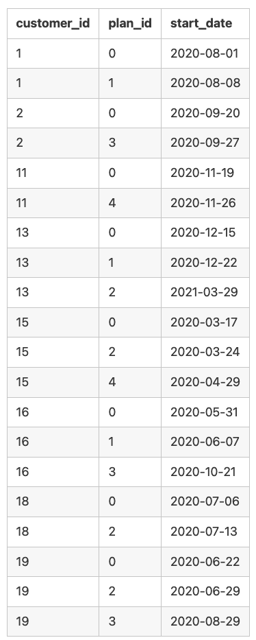

# Case Study 3 - Foodie Fi
*This case study is part of the 8 weeks SQL challenge which you can find details [here](https://8weeksqlchallenge.com/)

## Introduction
Subscription based businesses are super popular and Danny realised that there was a large gap in the market - he wanted to create a new streaming service that only had food related content - something like Netflix but with only cooking shows!

Danny finds a few smart friends to launch his new startup Foodie-Fi in 2020 and started selling monthly and annual subscriptions, giving their customers unlimited on-demand access to exclusive food videos from around the world!

Danny created Foodie-Fi with a data driven mindset and wanted to ensure all future investment decisions and new features were decided using data. This case study focuses on using subscription style digital data to answer important business questions.

## Available Data and Business Case
Danny has shared the data design for Foodie-Fi and also short descriptions on each of the database tables:


**Table 1: plans**
Customers can choose which plans to join Foodie-Fi when they first sign up.

Basic plan customers have limited access and can only stream their videos and is only available monthly at $9.90

Pro plan customers have no watch time limits and are able to download videos for offline viewing. Pro plans start at $19.90 a month or $199 for an annual subscription.

Customers can sign up to an initial 7 day free trial where they will automatically continue with the pro monthly subscription plan unless they cancel, downgrade to basic or upgrade to an annual pro plan at any point during the trial.

When customers cancel their Foodie-Fi service - they will have a churn plan record with a null price but their plan will continue until the end of the billing period. See table below:<br><br>

<br>

**Table 2: subscriptions**
Customer subscriptions show the exact date where their specific plan_id starts.

If customers downgrade from a pro plan or cancel their subscription - the higher plan will remain in place until the period is over - the start_date in the subscriptions table will reflect the date that the actual plan changes.

When customers upgrade their account from a basic plan to a pro or annual pro plan - the higher plan will take effect straightaway.

When customers churn - they will keep their access until the end of their current billing period but the start_date will be technically the day they decided to cancel their service. See sample table below:<br><br>


<br>

## Danny's questions and my SQL solutions:

### Customer Journey

**Based off the 8 sample customers provided in the sample from the subscriptions table, write a brief description about each customer’s onboarding journey.**

```sql
SELECT
  s.customer_id,
  p.plan_name,
  s.start_date
FROM foodie_fi.subscriptions AS s
INNER JOIN foodie_fi.plans AS p
  ON s.plan_id = p.plan_id
  WHERE s.customer_id IN ('1', '2', '11', '13', '15', '16', '18', '19')
ORDER BY customer_id, start_date;
```

**Output**

customer_id | plan_name | start_date
--  |  -- | --
1 | trial | 2020-08-01
1 | basic monthly | 2020-08-08
2 | trial | 2020-09-20
2 | pro annual  | 2020-09-27
11 |  trial | 2020-11-19
11  | churn | 2020-11-26
13  | trial | 2020-12-15
13  | basic monthly | 2020-12-22
13  | pro monthly | 2021-03-29
15  | trial | 2020-03-17
15  | pro monthly  | 2020-03-24
15  | churn | 2020-04-29
16  | trial | 2020-05-31
16  | basic monthly | 2020-06-07
16  | pro annual  | 2020-10-21
18  | trial | 2020-07-06
18  | pro monthly | 2020-07-13
19  | trial | 2020-06-22
19  | pro monthly | 2020-06-29
19  | pro annual  | 2020-08-29
<br>

---
### Data Analysis Questions

**1. How many customers has Foodie-Fi ever had?**

```sql
SELECT 
  COUNT(*) AS total_customer_num
FROM(
  SELECT DISTINCT customer_id
    FROM foodie_fi.subscriptions) AS subquery
;
```

**Output**

total_customer_num
--|
1000

