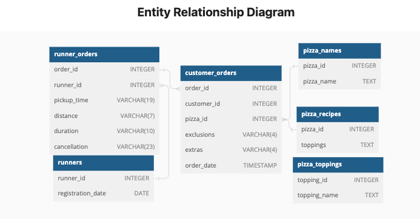

# Case Study 2 - Pizza Runner
*This case study is part of the 8 weeks SQL challenge which you can find details [here](https://8weeksqlchallenge.com/)

## Introduction
Danny was scrolling through his Instagram feed when something really caught his eye - “80s Retro Styling and Pizza Is The Future!”

Danny was sold on the idea, but he knew that pizza alone was not going to help him get seed funding to expand his new Pizza Empire - so he had one more genius idea to combine with it - he was going to Uberize it - and so Pizza Runner was launched!

Danny started by recruiting “runners” to deliver fresh pizza from Pizza Runner Headquarters (otherwise known as Danny’s house) and also maxed out his credit card to pay freelance developers to build a mobile app to accept orders from customers.

## Problem Statement and Available Data
Danny is  very aware that data collection was going to be critical for his business’ growth. He has prepared for us an entity relationship diagram (see below) of his database design but requires further assistance to clean his data and apply some basic calculations so he can better direct his runners and optimise Pizza Runner’s operations.



## Danny's questions and my SQL solutions:

### Pizza Metrics

**1. How many pizzas were ordered?**

```sql
SELECT
  COUNT(pizza_id) 
FROM pizza_runner.customer_orders;
```

**Output**

count |
----  |
14    |

**2. How many unique customer orders were made?**

```sql
SELECT
  COUNT(DISTINCT order_id)
FROM pizza_runner.customer_orders;
```
**Output**

count |
----  |
10    |

**3. How many successful orders were delivered by each runner?**

```sql
SELECT
  runner_id,
  COUNT(DISTINCT order_id) 
FROM pizza_runner.runner_orders
WHERE cancellation IS NULL 
  OR cancellation NOT IN ('Restaurant Cancellation', 'Customer Cancellation')
GROUP BY runner_id
ORDER BY 2 DESC;
```

**Output**
runner_id   | count
----------- | ------------
1           | 4
2           | 3
3           | 1

**4. How many of each type of pizza was delivered?**

```sql
SELECT
  names.pizza_name,
  COUNT(delivery.*) AS number_ordered
FROM pizza_runner.runner_orders AS delivery
INNER JOIN pizza_runner.customer_orders AS orders
  ON delivery.order_id = orders.order_id
INNER JOIN pizza_runner.pizza_names AS names
  ON orders.pizza_id = names.pizza_id
WHERE delivery.cancellation IS NULL
  OR delivery.cancellation NOT IN ('Restaurant Cancellation', 'Customer Cancellation')
GROUP BY names.pizza_name
ORDER BY number_ordered DESC;
```
**Output**

pizza_name          | number_ordered
---------         | ------------
Meatloves           | 9
Vegetarian          | 3

**5. How many Vegetarian and Meatlovers were ordered by each customer?**

```sql
SELECT
  orders.customer_id,
  SUM(CASE WHEN names.pizza_name = 'Vegetarian' THEN 1 ELSE 0 END) AS vegetarian,
  SUM(CASE WHEN names.pizza_name = 'Meatlovers' THEN 1 ELSE 0 END) AS meatlovers
FROM pizza_runner.customer_orders AS orders
INNER JOIN pizza_runner.pizza_names AS names
  ON orders.pizza_id = names.pizza_id
GROUP BY
  orders.customer_id
ORDER BY customer_id;
```

**Output**

customer_id   |vegetarian    | meatlovers
---------     | ----------   | ------------
101  |  2     | 1
102  |  2     | 1
103  |  3     | 1
104  | 3      | 0
105  | 0     | 1

**6. What was the maximum number of pizzas delivered in a single order?**

```sql
SELECT
  runner.order_id,
  COUNT(orders.pizza_id) AS pizza_delivered
FROM pizza_runner.runner_orders AS runner
INNER JOIN pizza_runner.customer_orders AS orders
  ON runner.order_id = orders.order_id
WHERE runner.cancellation IS NULL
  OR runner.cancellation NOT IN ('Restaurant Cancellation', 'Customer Cancellation')
GROUP BY runner.order_id
ORDER BY pizza_delivered DESC
LIMIT 1;
```
**Output**

order_id  |   pizza_delivered
---- | ---
4   | 3

**7. For each customer, how many delivered pizzas had at least 1 change and how many had no changes?**

```sql
WITH orders AS(
SELECT
  customer_id,
  order_id,
  CASE WHEN exclusions IN ('null', '') THEN NULL ELSE exclusions END,
  CASE WHEN extras IN ('null', '') THEN NULL ELSE extras END
FROM pizza_runner.customer_orders
)

SELECT
  t1.customer_id,
  SUM(CASE WHEN t1.exclusions IS NULL OR t1.extras IS NULL THEN 1 ELSE 0 END) AS pizza_no_change,
  SUM(CASE WHEN t1.exclusions is NOT NULL OR t1.extras IS NOT NULL THEN 1 ELSE 0 END) AS pizza_with_change
FROM
  orders AS t1
INNER JOIN pizza_runner.runner_orders AS t2
  ON t1.order_id = t2.order_id
  WHERE (t2.cancellation IS NULL OR t2.cancellation NOT IN ('Restaurant Cancellation', 'Customer Cancellation'))
GROUP BY customer_id
ORDER BY customer_id;
```

**Output**

customer_id    |  pizza_no_change   | pizza_with_change
--- | ---- | ----
101  |  2  |  0
102  |  3  |  0
103  |  3  |  3
104  | 2   |  2  
105  | 1  | 1

**8. How many pizzas were delivered that had both exclusions and extras?**

```sql
WITH pizza AS(
  SELECT
    t1.order_id,
    t1.pizza_id,
    t2.cancellation,
    CASE WHEN t1.exclusions IN ('null', '') THEN NULL ELSE exclusions END,
    CASE WHEN t1.extras IN ('null', '') THEN NULL ELSE extras END
  FROM pizza_runner.customer_orders AS t1
  INNER JOIN pizza_runner.runner_orders AS t2
  ON t1.order_id = t2.order_id
)

SELECT
  COUNT(*) AS total_pizza_count
FROM pizza
WHERE cancellation NOT IN ('Restaurant Cancellation', 'Customer Cancellation')
  AND (exclusions IS NOT NULL AND extras IS NOT NULL);

```

**Output**

total_pizza_count  |
--- |
1   |

**9. What was the total volume of pizzas ordered for each hour of the day?**

```sql
SELECT
  DATE_PART('HOUR', order_time:: TIMESTAMP) AS day_hour,
  COUNT(*) AS total_pizza_ordered
FROM pizza_runner.customer_orders
GROUP BY day_hour
ORDER BY day_hour;
```

**Output**

day_hour   |  total_pizza_ordered
---  | ---
11   |  1
13   |  3
18   |  3
19   |  1
21   |  3
23   |  3

**10. What was the volume of orders for each day of the week?**

```sql
SELECT
  TO_CHAR(order_time, 'Dy') AS day_of_week,
  COUNT(*) AS total_pizza_ordered
FROM pizza_runner.customer_orders
GROUP BY day_of_week, DATE_PART('dow', order_time)
ORDER BY DATE_PART('dow', order_time);
```

**Output**

day_of_week  |  total_pizza_ordered
-- | --
Sun   |   1
Mon   |   5
Fri   |   5
Sat   |   3

----

### Runner and Customer Experience

**1. How many runners signed up for each 1 week period? (i.e. week starts 2021-01-01)**

```sql
SELECT
-- date_trunc function considers Monday as the week start day. 1st Jan 2021 is a Friday. Hence + 4 is added
  DATE_TRUNC('week', registration_date)::DATE + 4 as week_number,
  COUNT(*)
FROM pizza_runner.runners
GROUP BY week_number
ORDER BY week_number;
```

**Output**

week_number   |   count
-- | --
2021-01-01     |  2
2021-01-08     |  1
2021-01-15     |  1

**2. What was the average time in minutes it took for each runner to arrive at the Pizza Runner HQ to pickup the order?**

```sql
WITH pickup_time AS (
-- DISTINCT is used here because there are multiple orders with the same order_id
SELECT DISTINCT
  orders.order_id,
  runner.runner_id,
-- cast as integer for the rounding later on, pickup_time is VARCHAR so need to cast as TIMESTAMP
  DATE_PART('minute', AGE(runner.pickup_time::TIMESTAMP, orders.order_time))::INTEGER AS pickup_minutes
FROM pizza_runner.runner_orders AS runner
INNER JOIN pizza_runner.customer_orders AS orders
  ON orders.order_id = runner.order_id
WHERE runner.pickup_time <> 'null'
)

SELECT
  runner_id,
  ROUND(AVG(pickup_minutes), 2) AS avg_pickup_minutes
FROM pickup_time
GROUP BY runner_id
ORDER BY avg_pickup_minutes;
```

**Output**

runner_id   |   avg_pickup_minutes
--  | ---
3   |  10.00
1   |  14.00
2   |  19.67

**3. Is there any relationship between the number of pizzas and how long the order takes to prepare?**

```sql
SELECT DISTINCT
  orders.order_id,
  COUNT(pizza_id) AS pizza_num,
  DATE_PART('minute', AGE(runner.pickup_time::TIMESTAMP, orders.order_time)) AS prep_time
FROM pizza_runner.customer_orders AS orders
INNER JOIN pizza_runner.runner_orders AS runner
  ON orders.order_id = runner.order_id
WHERE runner.pickup_time <> 'null'
GROUP BY orders.order_id, prep_time
ORDER BY pizza_num;
```

**Output**

order_id   |  pizza_num.   |  prep_time
-- | -- | ---
1  |  1  | 10
2  |  1  | 10
5  |  1  | 10
7  |  1  | 10
8  |  1  | 20
3  | 2   | 21
10 | 2   | 15
4  | 3   | 29

**4. What was the average distance travelled for each customer?**

```sql
WITH cte AS(
  SELECT DISTINCT
    orders.customer_id,
    -- Using REGEXP_MATCHES to find one or more digits, commas and decimal points as 'distance' contains numbers, decimal points and characters
    -- UNNEST converts the results to a single array
    UNNEST(REGEXP_MATCHES(runner.distance, '(^[0-9,.]+)'))::NUMERIC AS distance
  FROM pizza_runner.customer_orders AS orders
  INNER JOIN pizza_runner.runner_orders AS runner
    ON orders.order_id = runner.order_id
  WHERE runner.pickup_time <> 'null'
)

SELECT
  customer_id,
  ROUND(AVG(distance),2)  AS avg_distance
FROM cte
GROUP BY customer_id
ORDER BY customer_id;
```

**Output**

customer_id   |   avg_distance
-- | --
101   |  20.00
102   |  18.40
103   |  23.40
104   |  10.00
105   |  25.00

**5. What was the difference between the longest and shortest delivery times for all orders?**

```sql
WITH adj_duration AS( 
  SELECT
    UNNEST(REGEXP_MATCHES(duration, '(^[0-9,.]+)'))::NUMERIC AS duration
  FROM pizza_runner.runner_orders
  WHERE pickup_time <>'null'
)

SELECT
  MAX(duration) AS longest_duration,
  MIN(duration) AS shortest_duration,
  MAX(duration) - MIN(duration) AS difference
FROM adj_duration;
```

**Output**

longest_duration  |  shortest_duration   |  difference
--- | --- | ---
40  |  10   |  30

**6. What was the average speed for each runner for each delivery and do you notice any trend for these values?**

```sql
WITH adj_data AS(
  SELECT
    runner_id,
    order_id,
    UNNEST(REGEXP_MATCHES(distance, '(^[0-9,.]+)'))::NUMERIC AS distance,
    UNNEST(REGEXP_MATCHES(duration, '(^[0-9,.]+)'))::NUMERIC AS duration
  FROM pizza_runner.runner_orders
  WHERE pickup_time <> 'null'
)

SELECT
  runner_id,
  order_id,
  distance,
  duration,
  ROUND(AVG(distance/(duration / 60)),2) AS avg_speed
FROM adj_data
GROUP BY runner_id, order_id, distance, duration
ORDER BY avg_speed DESC;
```

**Output**

runner_id    |  order_id  |  distance    |  duration  | avg_speed
--  | ---  | ---- | -- | ----
2  |  8   |  23.4   | 15  |  93.60
2  |  7  |  25  |  25  |  60.00
1  |  10  | 10  | 10  |  60.00
1  |  2  | 20   | 27  | 40.44
1  |  3  | 13.4   |  20  | 40.20
3  |   5  |  10   |  15  | 40.00
1  |  1  | 20  | 32  |37.50

**7. What is the successful delivery percentage for each runner?**

```sql
SELECT
  runner_id,
  100 * SUM(CASE WHEN pickup_time <> 'null' THEN 1 ELSE 0 END) / COUNT(*) AS success_percentage
FROM pizza_runner.runner_orders
GROUP BY runner_id
ORDER BY success_percentage DESC;
```

**Output**

runner_id  |  success_percentage
--  | --
1 | 100
2 | 75
3 | 50

---
### Ingredient Optimisation
**1. What are the standard ingredients for each pizza?**

```sql
WITH ingredients AS(
SELECT
  pizza_id,
  REGEXP_SPLIT_TO_TABLE(toppings, '[,\s]+')::INTEGER AS topping_id
FROM pizza_runner.pizza_recipes
),

pizza_ingredients AS(
SELECT
  pizza_id,
  STRING_AGG(t2.topping_name ::TEXT, ', ') AS standard_ingredients
FROM ingredients AS t1
INNER JOIN pizza_runner.pizza_toppings AS t2
  ON t1.topping_id = t2.topping_id
GROUP BY pizza_id
)

SELECT 
  t3.pizza_name,
  t4.standard_ingredients
FROM pizza_runner.pizza_names AS t3
INNER JOIN pizza_ingredients AS t4
  ON t3.pizza_id = t4.pizza_id
GROUP BY pizza_name, standard_ingredients;
```
**Output**

pizza_name  | standard_ingredients
--  | --
Meatlovers  | Bacon, BBQ Sauce, Beef, Chicken, Mushrooms, Pepperoni, Salami
Vegetarian  | Cheese, Mushrooms, Onions, Peppers, Tomatoes, Tomato Sauce

**2. What was the most commonly added extra?**

```sql
WITH cte_extras AS(
SELECT
  REGEXP_SPLIT_TO_TABLE(extras, '[,\s]+'):: INTEGER AS topping_id
FROM pizza_runner.customer_orders
WHERE extras IS NOT NULL AND extras NOT IN ('null', '')
)

SELECT
  topping_name,
  COUNT(*) AS extras_count
FROM cte_extras
INNER JOIN pizza_runner.pizza_toppings
ON pizza_toppings.topping_id = cte_extras.topping_id
GROUP BY topping_name
ORDER BY extras_count DESC
LIMIT 1;
```

**Output**

topping_name  | extras_count
--  | --
Bacon | 4

**3. What was the most common exclusion?**

```sql
WITH cte_exclusions AS(
SELECT
  REGEXP_SPLIT_TO_TABLE(exclusions, '[,\s]+'):: INTEGER AS topping_id
FROM pizza_runner.customer_orders
WHERE exclusions IS NOT NULL AND exclusions NOT IN ('null', '')
)

SELECT
  topping_name,
  COUNT(*) AS exclusion_count
FROM cte_exclusions
INNER JOIN pizza_runner.pizza_toppings
ON pizza_toppings.topping_id = cte_exclusions.topping_id
GROUP BY topping_name
ORDER BY exclusion_count DESC
LIMIT 1;
```

**Output**

topping_name  | exclusion_count
--  | --
Cheese | 4

**4. Generate an order item for each record in the customers_orders table in the format of one of the following:<br>
Meat Lovers<br>
Meat Lovers - Exclude Beef<br>
Meat Lovers - Extra Bacon<br>
Meat Lovers - Exclude Cheese, Bacon - Extra Mushroom, Peppers**<br>

```sql
WITH cte_cleaned_customer_orders AS (
  SELECT
    order_id,
    customer_id,
    pizza_id,
    CASE
      WHEN exclusions IN ('', 'null') THEN NULL
      ELSE exclusions END
    AS exclusions,
    CASE
      WHEN extras IN ('', 'null') THEN NULL
      ELSE extras END
    AS extras,
    order_time,
    ROW_NUMBER() OVER () AS original_row_number
  FROM pizza_runner.customer_orders
),

cte_extras_exclusions AS (
    SELECT
      order_id,
      customer_id,
      pizza_id,
      REGEXP_SPLIT_TO_TABLE(exclusions, '[,\s]+')::INTEGER AS exclusions_topping_id,
      REGEXP_SPLIT_TO_TABLE(extras, '[,\s]+')::INTEGER AS extras_topping_id,
      order_time,
      original_row_number
    FROM cte_cleaned_customer_orders
    WHERE exclusions IS NOT NULL OR extras IS NOT NULL
  
  UNION
    SELECT
      order_id,
      customer_id,
      pizza_id,
      NULL AS exclusions_topping_id,
      NULL AS extras_topping_id,
      order_time,
      original_row_number
    FROM cte_cleaned_customer_orders
    WHERE exclusions IS NULL OR extras IS NULL
),

complete_dataset AS(
SELECT
  t1.order_id,
  t1.customer_id,
  t1.pizza_id,
  t2.pizza_name,
  t1.order_time,
  t1.original_row_number,
  STRING_AGG(exclusions.topping_name, ', ') AS exclusions,
  STRING_AGG(extras.topping_name, ', ') AS extras
FROM cte_extras_exclusions AS t1
INNER JOIN pizza_runner.pizza_names AS t2
  ON t1.pizza_id = t2.pizza_id
LEFT JOIN pizza_runner.pizza_toppings AS exclusions
  ON t1.exclusions_topping_id = exclusions.topping_id
LEFT JOIN pizza_runner.pizza_toppings AS extras
  ON t1.extras_topping_id = extras.topping_id
GROUP BY
  t1.order_id,
  t1.customer_id,
  t1.pizza_id,
  t2.pizza_name,
  t1.order_time,
  t1.original_row_number
),

cte_parsed_string_output AS(
SELECT
  order_id,
  customer_id,
  pizza_id,
  order_time,
  original_row_number,
  pizza_name,
  CASE WHEN exclusions IS NULL THEN '' ELSE ' - Exclude ' || exclusions END AS exclusions,
  CASE WHEN extras IS NULL THEN '' ELSE ' - Extra ' || extras END AS extras
FROM complete_dataset
),

final_output AS(
SELECT
  order_id,
  customer_id,
  pizza_id,
  order_time,
  original_row_number,
  pizza_name || extras || exclusions AS order_item
FROM cte_parsed_string_output
)

SELECT
  order_id,
  customer_id,
  pizza_id,
  order_time,
  order_item
FROM final_output
ORDER BY original_row_number;
```
**Output**

order_id  | customer_id | pizza_id  | order_time  | order_item
--  | --  | --  | --  | --
1 | 101 | 1 | 2021-01-01 18:05:02 | Meatlovers
2 | 101 | 1 | 2021-01-01 19:00:52 | Meatlovers
3 | 102 | 1 | 2021-01-02 23:51:23 | Meatlovers
3 | 102 | 2 | 2021-01_02 23:51:23 | Vegetarian
4 | 103 | 1 | 2021-01-04 13:23:46 | Meatlovers - Exclude Cheese
4 | 103 | 1 | 2021-01-04 13:23:46 | Meatlovers - Exclude Cheese
4 | 103 | 2 | 2021-01-04 13:23:46 | Vegetarian - Exclude Cheese
5 | 104 | 1 | 2021-01-08 21:00:29 | Meatlovers - Extra Bacon
6 | 101 | 2 | 2021-01-08 21:03:13 | Vegetarian
7 | 105 | 2 | 2021-01-08 21:20:29 | Vegetarian - Extra Bacon
8 | 102 | 1 | 2021-01-09 23:54:33 | Meatlovers
9 | 103 | 1 | 2021-01-10 11:22:59 | Meatlovers - Extra Bacon, Chicken - Exclude Cheese
10 | 104 | 1 | 2021-01-11 18:34:49 | Meatlovers 
10 | 104 | 1 | 2021-01-11 18:34:49 | Meatlovers - Extra Bacon, Cheese - Exclude BBQ Sauce, Mushrooms

**5. Generate an alphabetically ordered comma separated ingredient list for each pizza order from the customer_orders table and add a 2x in front of any relevant ingredients**

Steps taken can be summarised as follows:
1. Clean the customer_orders table so that exclusions and extras are correctly reflected with NULL where applicable.
2. Split the toppings found on pizza_recipes table so that each topping is represented separately as a row
3. Then join the ouput in step 2 back to the customer_orders table
4. Work out the customer orders that had exclusions and extras
5. Combine output in Step 3 with outputs from Step 4 by excluding the exclusions and adding the extras
6. You can then start counting how many toppings had more than 1 in your combined output in step 5.

```sql
WITH cte_cleaned_customer_orders AS (
  SELECT
    order_id,
    customer_id,
    pizza_id,
    CASE
      WHEN exclusions IN ('', 'null') THEN NULL
      ELSE exclusions END
    AS exclusions,
    CASE
      WHEN extras IN ('', 'null') THEN NULL
      ELSE extras END
    AS extras,
    order_time,
    ROW_NUMBER() OVER () AS original_row_number
  FROM pizza_runner.customer_orders
),
-- first split the toppings
cte_regular_toppings AS (
SELECT
  pizza_id,
  REGEXP_SPLIT_TO_TABLE(toppings, '[,\s]+')::INTEGER AS topping_id
FROM pizza_runner.pizza_recipes
),
-- join the toppings with all pizzas orders
cte_base_toppings AS (
  SELECT
    cte_cleaned_customer_orders.order_id,
    cte_cleaned_customer_orders.customer_id,
    cte_cleaned_customer_orders.pizza_id,
    cte_cleaned_customer_orders.order_time,
    cte_cleaned_customer_orders.original_row_number,
    cte_regular_toppings.topping_id
  FROM cte_cleaned_customer_orders
  LEFT JOIN cte_regular_toppings
    ON cte_cleaned_customer_orders.pizza_id = cte_regular_toppings.pizza_id
),
-- get the exclusions and extras
cte_exclusions AS (
  SELECT
    order_id,
    customer_id,
    pizza_id,
    order_time,
    original_row_number,
    REGEXP_SPLIT_TO_TABLE(exclusions, '[,\s]+')::INTEGER AS topping_id
  FROM cte_cleaned_customer_orders
  WHERE exclusions IS NOT NULL
),
cte_extras AS (
  SELECT
    order_id,
    customer_id,
    pizza_id,
    order_time,
    original_row_number,
    REGEXP_SPLIT_TO_TABLE(extras, '[,\s]+')::INTEGER AS topping_id
  FROM cte_cleaned_customer_orders
  WHERE extras IS NOT NULL
),
-- combine the cutomer orders with the extras, excluding the exclusions
cte_combined_orders AS (
  SELECT * FROM cte_base_toppings
  EXCEPT
  SELECT * FROM cte_exclusions
  UNION ALL
  SELECT * FROM cte_extras
),
-- count the topping ID from the combined output and obtain pizza and topping names from pizza_names and pizza_toppings tables
cte_joined_toppings AS (
  SELECT
    t1.order_id,
    t1.customer_id,
    t1.pizza_id,
    t1.order_time,
    t1.original_row_number,
    t1.topping_id,
    t2.pizza_name,
    t3.topping_name,
    COUNT(t1.*) AS topping_count
  FROM cte_combined_orders AS t1
  INNER JOIN pizza_runner.pizza_names AS t2
    ON t1.pizza_id = t2.pizza_id
  INNER JOIN pizza_runner.pizza_toppings AS t3
    ON t1.topping_id = t3.topping_id
  GROUP BY
    t1.order_id,
    t1.customer_id,
    t1.pizza_id,
    t1.order_time,
    t1.original_row_number,
    t1.topping_id,
    t2.pizza_name,
    t3.topping_name
)
--final output
SELECT
  order_id,
  customer_id,
  pizza_id,
  order_time,
  pizza_name,
  STRING_AGG(
    CASE
      WHEN topping_count > 1 THEN topping_count || 'x ' || topping_name
      ELSE topping_name
      END,
    ', '
  ) AS ingredients_list,
  original_row_number
FROM cte_joined_toppings
GROUP BY
  order_id,
  customer_id,
  pizza_id,
  order_time,
  pizza_name,
  original_row_number
 
```
**Output**

order_id  | customer_id | pizza_id  | order_time  | pizza_name  | ingredients_list  | original_row_number
--  | --  | --  | --  | --  | --  | --  
1 | 101 | 1 | 2021-01-01 18:05:02 | Meatlovers  | Bacon, BBQ Sauce, Beef, Cheese, Chicken, Mushrooms, Pepperoni, Salami | 1
2 | 101 | 1 | 2021-01-01 19:00:52 | Meatlovers  | Bacon, BBQ Sauce, Beef, Cheese, Chicken, Mushrooms, Pepperoni, Salami | 2
3 | 102 | 1 | 2021-01-02 23:51:23 | Meatlovers  | Bacon, BBQ Sauce, Beef, Cheese, Chicken, Mushrooms, Pepperoni, Salami | 3
3 | 102 | 2 | 2021-01_02 23:51:23 | Vegetarian  | Cheese, Mushrooms, Onions, Peppers, Tomatoes, Tomato Sauce  | 4
4 | 103 | 1 | 2021-01-04 13:23:46 | Meatlovers  | Bacon, BBQ Sauce, Beef, Chicken, Mushrooms, Pepperoni, Salami | 5
4 | 103 | 1 | 2021-01-04 13:23:46 | Meatlovers  | Bacon, BBQ Sauce, Beef, Chicken, Mushrooms, Pepperoni, Salami | 6
4 | 103 | 2 | 2021-01-04 13:23:46 | Vegetarian  | Mushrooms, Onions, Peppers, Tomatoes, Tomato Sauce  | 7
5 | 104 | 1 | 2021-01-08 21:00:29 | Meatlovers  | 2x Bacon, BBQ Sauce, Beef, Cheese, Chicken, Mushrooms, Pepperoni, Salami  |8
6 | 101 | 2 | 2021-01-08 21:03:13 | Vegetarian  | Cheese, Mushrooms, Onions, Peppers, Tomatoes, Tomato Sauce  | 9
7 | 105 | 2 | 2021-01-08 21:20:29 | Vegetarian  | Bacon, Cheese, Mushrooms, Onions, Peppers, Tomatoes, Tomato Sauce | 10
8 | 102 | 1 | 2021-01-09 23:54:33 | Meatlovers  | Bacon, BBQ Sauce, Beef, Cheese, Chicken, Mushrooms, Pepperoni, Salami | 11
9 | 103 | 1 | 2021-01-10 11:22:59 | Meatlovers  | 2x Bacon, BBQ Sauce, Beef, 2x Chicken, Mushrooms, Pepperoni, Salami | 12
10  | 104 | 1 |2021-01-11 18:34:49 | Meatlovers | Bacon, BBQ Sauce, Beef, Cheese, Chicken, Mushrooms, Pepperoni, Salami | 13
10  | 104 | 1 |2021-01-11 18:34:49 | Meatlovers | 2x Bacon, Beef, 2x Cheese, Chicken, Pepperoni, Salami | 14

**6. What is the total quantity of each ingredient used in all delivered pizzas sorted by most frequent first?**

The answer is similar to Q5 above except that we now have to account only for delivered pizzas. Therefore we joined the customer_orders table with the runner_orders table to filter out the cancellations. This is when the runner pickup_time is null.

```sql
WITH cleaned_delivered_orders AS (
  SELECT
    r.order_id,
    o.customer_id,
    o.pizza_id,
    CASE
      WHEN exclusions IN ('', 'null') THEN NULL
      ELSE exclusions END
    AS exclusions,
    CASE
      WHEN extras IN ('', 'null') THEN NULL
      ELSE extras END
    AS extras,
    order_time,
    ROW_NUMBER() OVER () AS original_row_number
  FROM pizza_runner.customer_orders AS o
  INNER JOIN pizza_runner.runner_orders AS r
    ON o.order_id = r.order_id
    -- Note that the question says 'delivered pizza'. Therefore we need to account for cancellations and this is when runner pickup_time were nulls.
    AND r.pickup_time <> 'null'
),
    
cte_regular_toppings AS(
  SELECT
    pizza_id,
    REGEXP_SPLIT_TO_TABLE(toppings, '[,\s]+')::INTEGER AS topping_id
  FROM pizza_runner.pizza_recipes
),
cte_base_toppings AS (
  SELECT
    cleaned_delivered_orders.order_id,
    cleaned_delivered_orders.customer_id,
    cleaned_delivered_orders.pizza_id,
    cleaned_delivered_orders.order_time,
    cleaned_delivered_orders.original_row_number,
    cte_regular_toppings.topping_id
  FROM cleaned_delivered_orders
  LEFT JOIN cte_regular_toppings
    ON cleaned_delivered_orders.pizza_id = cte_regular_toppings.pizza_id
),

-- get the exclusions and extras
cte_exclusions AS (
  SELECT
    order_id,
    customer_id,
    pizza_id,
    order_time,
    original_row_number,
    REGEXP_SPLIT_TO_TABLE(exclusions, '[,\s]+')::INTEGER AS topping_id
  FROM cleaned_delivered_orders
  WHERE exclusions IS NOT NULL
),
cte_extras AS (
  SELECT
    order_id,
    customer_id,
    pizza_id,
    order_time,
    original_row_number,
    REGEXP_SPLIT_TO_TABLE(extras, '[,\s]+')::INTEGER AS topping_id
  FROM cleaned_delivered_orders
  WHERE extras IS NOT NULL
),
-- combine the cutomer orders with the extras, excluding the exclusions
cte_combined_orders AS (
  SELECT * FROM cte_base_toppings
  EXCEPT
  SELECT * FROM cte_exclusions
  UNION ALL
  SELECT * FROM cte_extras
)
  
SELECT
  t2.topping_name,
  COUNT(t1.*) AS total_topping_used
FROM cte_combined_orders AS t1
INNER JOIN pizza_runner.pizza_toppings AS t2
  ON t1.topping_id = t2.topping_id
GROUP BY
  topping_name
ORDER BY total_topping_used DESC;

```

**Output**

topping_name  | total_topping_used
--  | --
Bacon | 12
Mushrooms | 11
Cheese  | 10
Pepperoni | 9
Chicken | 9
Salami  | 9
Beef  | 9
BBQ Sauce | 8
Tomato Sauce  | 3
Onions  | 3
Tomatoes  | 3
Peppers | 3


